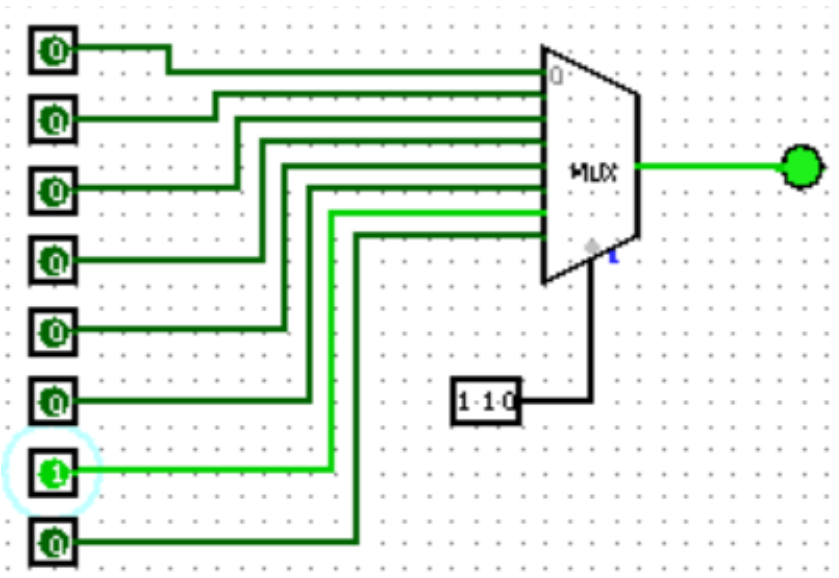

# 🔌 8x1 Multiplexer Logic Design

## 📌 Project Overview
In digital systems, a **Multiplexer (MUX)** is a device that selects one of several input signals and forwards it to a single output line. This project focuses on building an **8x1 Multiplexer** from scratch using basic logic gates (AND, OR, NOT), demonstrating the core principles of data selection and routing.

## ⚙️ Logic Specification
The 8x1 MUX uses **3 select lines** ($S_2, S_1, S_0$) to choose between **8 input lines** ($I_0$ to $I_7$).

### Boolean Equation:
The output $Y$ is defined by the following logic:
$$Y = (S_2' S_1' S_0' I_0) + (S_2' S_1' S_0 I_1) + (S_2' S_1 S_0' I_2) + (S_2' S_1 S_0 I_3) + (S_2 S_1' S_0' I_4) + (S_2 S_1' S_0 I_5) + (S_2 S_1 S_0' I_6) + (S_2 S_1 S_0 I_7)$$

## 🛠️ Implementation
The circuit was designed and simulated using **Logisim**. The repository includes:
- **Gate-Level Implementation:** Using individual AND, OR, and NOT gates to build the MUX logic.
- **Truth Table Verification:** Ensuring each select line combination correctly routes the corresponding input.

## 🚀 Key Deliverables
- **Circuit Diagrams:** Detailed `.circ` files compatible with Logisim.
- **Technical Report:** Documentation of the design process, pin configurations, and logic verification.

## 📁 Repository Structure
- `Circuits/`: Contains `1.circ` and `2.circ` (Logisim simulation files).
- `Design/`: Contains the `mux_design.png` circuit diagram used in this documentation.
- `Documentation/`: Full project report detailing the truth table and equations.

## 👥 The Team
Developed by Computer Science students at **King Faisal University**:
- **Atekah Hussain Aljafar**
- **Sarh Alsalem**
- **Zainab Alhadhari**

---
*Part of the Digital Logic Design Course - KFU.*
---
*Connect with me on LinkedIn for more projects!*
[https://www.linkedin.com/in/ateka-hussain/](https://www.linkedin.com/in/ateka-hussain/)
